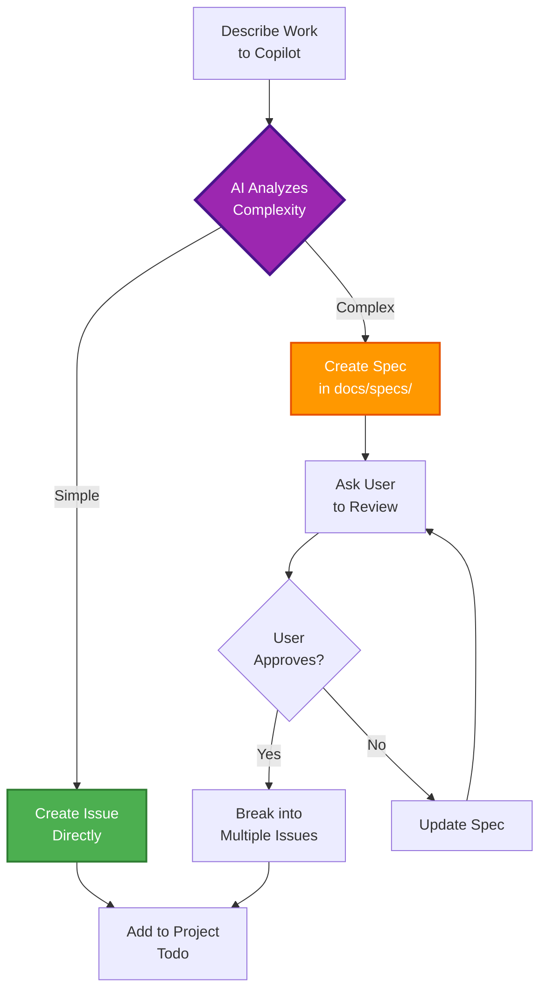

# 🧠 Intelligent Spec-First Decision Making

> **New in v2.4.0** - AI automatically decides when to create specs vs direct issues

## 🎯 Overview

UX Ingka Kit's intelligent AI analyzes the complexity of your work and automatically chooses the right development approach:

- **Simple work** → Direct issue creation (fast turnaround)
- **Complex work** → Create specification → Review → Break into focused issues

This ensures appropriate planning for complex features while maintaining velocity for simple tasks.

---

## 🤖 How It Works

### The Decision Process



### Analysis Criteria

The AI evaluates several factors:

1. **Architectural Impact**: Does it affect system design?
2. **Component Count**: How many parts of the system are involved?
3. **Effort Estimation**: Rough time estimate (hours vs days vs weeks)
4. **Team Discussion Needed**: Does it need approval or discussion?
5. **Breaking Down**: Will it naturally split into multiple issues?

---

## 📝 Decision Rules

### Create SPEC First (Complex Work)

The AI creates a specification file when work involves:

- 🏗️ **New features requiring architecture decisions**
  - Example: "Add OAuth2 authentication system"
  - Why: Multiple components, security considerations, integration design

- 🔧 **Significant system changes affecting multiple components**
  - Example: "Redesign the database schema"
  - Why: Impacts many parts, needs migration plan, breaking changes

- 📐 **Features needing design/planning (> 1 week effort)**
  - Example: "Implement real-time collaboration"
  - Why: Complex feature, multiple technologies, phased rollout

- 🤔 **Work requiring team discussion/approval**
  - Example: "Build admin dashboard"
  - Why: UX design needed, feature scope, security review

- 🎯 **Features that will generate multiple issues**
  - Example: "Add multi-language support"
  - Why: i18n setup, translations, testing, docs

### Create ISSUE Directly (Simple Work)

The AI creates an issue immediately when work is:

- 🐛 **Bug fixes** (clear problem, clear solution)
  - Example: "Fix login button not working on mobile"
  - Why: Single component, straightforward fix

- 📝 **Documentation updates**
  - Example: "Update README with installation steps"
  - Why: No code changes, clear scope

- ✨ **Small enhancements** (< 1 day effort)
  - Example: "Add dark mode toggle"
  - Why: Single feature, well-defined

- 🧪 **Adding tests**
  - Example: "Add unit tests for auth service"
  - Why: Clear scope, specific component

- 🎨 **UI polish/tweaks**
  - Example: "Improve button spacing in header"
  - Why: Visual change, quick iteration

- 🔧 **Refactoring single components**
  - Example: "Optimize search query performance"
  - Why: Isolated change, measurable improvement

---

## 📋 Spec Creation Workflow

### Step 1: AI Creates Spec

When complex work is detected, Copilot creates a file in `docs/specs/`:

```markdown
docs/specs/oauth2-authentication.md
```

**Spec Template Includes:**

```markdown
# OAuth2 Authentication System

## Problem Statement
Users currently can't log in securely with external providers.

## Proposed Solution
Implement OAuth2 authentication supporting Google and GitHub providers.

## Technical Approach
- Use passport.js for OAuth2 flow
- Store tokens securely in database
- Implement refresh token rotation

## Architecture Changes
- Add auth service layer
- Create user sessions table
- Update API middleware for auth

## Acceptance Criteria
- [ ] Users can log in with Google
- [ ] Users can log in with GitHub
- [ ] Sessions persist across page reloads
- [ ] Tokens refresh automatically
- [ ] Logout clears all sessions

## Implementation Plan
1. Setup OAuth2 providers
2. Create auth routes
3. Implement session management
4. Add frontend integration
5. Write tests

## Estimated Effort
2-3 weeks (Senior Developer)

## Dependencies
- passport.js
- express-session
- OAuth2 provider accounts
```

### Step 2: User Review

Copilot asks you to review:

```
✓ Created specification: docs/specs/oauth2-authentication.md

📋 Please review the spec:
- Does the approach make sense?
- Are there missing requirements?
- Should we adjust the scope?

Once approved, I'll break this down into actionable issues.
```

### Step 3: Approval & Breakdown

After your approval, Copilot creates focused issues:

```bash
# Issue #43: Setup OAuth2 providers (Google, GitHub)
# Labels: feature, p1, backend
# Estimated: 2-3 days

# Issue #44: Implement auth routes and middleware
# Labels: feature, p1, backend
# Estimated: 3-4 days

# Issue #45: Create user sessions database table
# Labels: feature, p1, database
# Estimated: 1-2 days

# Issue #46: Add frontend OAuth2 login buttons
# Labels: feature, p1, frontend
# Estimated: 2-3 days

# Issue #47: Write authentication tests
# Labels: testing, p2, backend
# Estimated: 2-3 days
```

All issues reference the spec:

```markdown
**Specification:** See [docs/specs/oauth2-authentication.md]

**Part of:** OAuth2 Authentication System (#43, #44, #45, #46, #47)
```

---

## 💡 Real-World Examples

### Example 1: Bug Fix (Direct Issue)

**Your Request:**
```
"The login button doesn't work on mobile Safari"
```

**AI Analysis:**
- ✅ Clear problem
- ✅ Single component (login UI)
- ✅ Quick fix (< 1 day)
- ✅ No architecture changes

**AI Action:**
```bash
✓ Creating issue #42...
✓ Issue created: "Fix login button not working on mobile Safari"
✓ Added to project board (Todo)
✓ Labels: bug, p1, frontend, mobile

Ready to work! 🚀
```

### Example 2: Feature Request (Spec First)

**Your Request:**
```
"Add real-time collaboration features with WebSocket support"
```

**AI Analysis:**
- ❌ Multiple components (WebSocket server, client, state sync)
- ❌ Architecture decisions (scaling, fallbacks)
- ❌ Estimated 3-4 weeks
- ❌ Needs team discussion

**AI Action:**
```bash
✓ Creating specification...
✓ Spec created: docs/specs/realtime-collaboration.md

📋 Please review the spec:

Key Decisions:
- WebSocket server architecture (Socket.io vs native)
- State synchronization strategy (operational transform)
- Scaling considerations (Redis adapter)
- Fallback for browsers without WebSocket support

Review the spec and let me know if the approach looks good.
Once approved, I'll break this into 8-10 focused issues.
```

### Example 3: Medium Complexity (Context-Dependent)

**Your Request:**
```
"Add user profile page with avatar upload"
```

**AI Analysis (Could go either way):**
- Storage: Where to store avatars? (S3, local, CDN)
- Processing: Image resizing, format conversion
- Security: Upload validation, size limits
- Scope: Just avatar or full profile editing?

**AI Action:**
```bash
❓ This could be done as a direct issue or with a spec.

Quick implementation (direct issue):
- Avatar upload to local storage
- Simple profile display
- Basic validation

OR

Full feature (spec):
- Cloud storage (S3)
- Image processing pipeline
- Comprehensive profile editing
- Security best practices

Which approach would you prefer?
```

---

## 🎯 Benefits

### For Simple Tasks
- ✅ **Fast turnaround** - No planning overhead
- ✅ **Quick iteration** - Start coding immediately
- ✅ **Reduced friction** - No unnecessary documentation
- ✅ **Maintain velocity** - Don't slow down for small work

### For Complex Features
- ✅ **Proper planning** - Think before you code
- ✅ **Team alignment** - Everyone reviews the spec
- ✅ **Clear scope** - Acceptance criteria defined
- ✅ **Parallel work** - Multiple people can work on different issues
- ✅ **Better estimates** - Implementation plan provides clarity
- ✅ **Reduced scope creep** - Spec defines boundaries

---

## 🔧 Configuration

### Customizing Decision Logic

You can influence the AI's decision by being explicit:

**Force Direct Issue:**
```
"[QUICK] Add logging to auth service"
```

**Force Spec:**
```
"[SPEC] Improve search performance"
```

**Provide Context:**
```
"Add pagination (simple version, just next/prev buttons)"
→ Direct issue

"Add pagination (with page numbers, jump to page, items per page selector)"
→ Spec first
```

### Project-Specific Thresholds

In your project's Copilot instructions, you can adjust:

```markdown
## Decision Thresholds

For our project:
- Simple: < 1 day effort
- Medium: 1-3 days (direct issue with detailed description)
- Complex: > 3 days or multiple components (spec required)

Always create specs for:
- Security features
- Database migrations
- Public API changes
```

---

## 📊 Metrics

### Effectiveness Tracking

How to measure if the decision logic is working:

**Good Signs:**
- ✅ Specs are actually reviewed and discussed
- ✅ Simple issues close quickly (< 2 days)
- ✅ Complex features have fewer scope changes
- ✅ Team alignment on architecture decisions

**Warning Signs:**
- ⚠️ Specs are rubber-stamped without review
- ⚠️ Simple work getting specs unnecessarily
- ⚠️ Complex work rushing to issues without planning

---

## 🤝 Best Practices

### For Users

1. **Be Descriptive**: More context helps AI make better decisions
2. **Review Specs Thoughtfully**: Don't just approve - actually review
3. **Ask Questions**: If AI's decision seems wrong, ask why
4. **Provide Feedback**: Help improve the decision logic

### For Teams

1. **Discuss Specs**: Use spec review as collaboration opportunity
2. **Update Specs**: Keep specs current as decisions change
3. **Reference Specs**: Link to specs in PRs and issues
4. **Archive Specs**: Move to `docs/archive/` when implemented

---

## ❓ FAQ

### Q: Can I override the AI's decision?

**A:** Yes! Just be explicit:
- "Create a spec for..." → Forces spec
- "Quick issue for..." → Forces direct issue

### Q: What if the spec needs changes after approval?

**A:** Update the spec file and re-run the breakdown. Copilot will update or create new issues as needed.

### Q: Can I use my own spec template?

**A:** Yes! Create `.github/spec-template.md` and Copilot will use it.

### Q: What if I disagree with the spec content?

**A:** Provide feedback! Edit the spec file or ask Copilot to revise specific sections.

### Q: Do specs slow down development?

**A:** For simple work, no - you get direct issues. For complex work, the upfront planning actually speeds up overall delivery by reducing rework and scope creep.

---

## 🔗 Related Documentation

- [Spec-Driven Development](./Spec-Driven-Development) - Overall philosophy
- [Automatic Issue Creation](./Automatic-Issue-Creation) - How issues are created
- [GitHub Projects Integration](./GitHub-Projects-Integration) - Project management
- [Commands Reference](./Commands-Reference) - CLI commands

---

**Last Updated:** October 19, 2025  
**Feature Version:** v2.4.0  
**Maintainer:** [@leonpagotto](https://github.com/leonpagotto)

---

<div align="center">

**[⬆ Back to Top](#-intelligent-spec-first-decision-making)**

Questions? [Open a Discussion](https://github.com/leopagotto/ux-ingka-kit/discussions)

</div>
